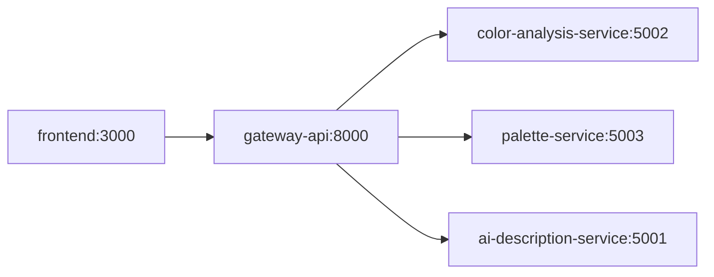

# ✨ Skin Tone & Color Analysis Microservices

Analyze personal colors to generate tailored clothing, makeup, and jewelry recommendations with AI support. Built as small, focused microservices that can run via Docker Compose or locally.

## 🏗️ Architecture



---

## ⚙️ Requirements

- [Node.js](https://nodejs.org/) (v18 or newer recommended)
- [npm](https://www.npmjs.com/) (comes with Node.js)
- [Docker](https://www.docker.com/) & [Docker Compose](https://docs.docker.com/compose/) (for running with containers)
- OpenAI API key (for AI description service)

---

## 🚀 Quick Start

### 1. Install Dependencies

```sh
npm install
```

### 2. Copy Example Environment Files

Copy the `example.env` files to `.env` for each service.

**On Windows Command Prompt:**

```cmd
copy ai-description-service\example.env ai-description-service\.env
copy palette-service\example.env palette-service\.env
copy gateway-api\example.env gateway-api\.env
copy color-analysis-service\example.env color-analysis-service\.env
copy frontend\.env.example frontend\.env
```

**On Mac/Linux/Git Bash:**

```sh
cp ai-description-service/example.env ai-description-service/.env
cp palette-service/example.env palette-service/.env
cp gateway-api/example.env gateway-api/.env
cp color-analysis-service/example.env color-analysis-service/.env
cp frontend/.env.example frontend/.env
```

### 3. Add Your OpenAI API Key

Edit `ai-description-service/.env` and set your `OPENAI_API_KEY`:

```
OPENAI_API_KEY=your_openai_api_key
```

### 4. Seed the Database

Make sure `APP_MODE=dev` is set in your `.env` files, then run:

```sh
npm run seed
```

### 5. Set the Mode

- For **local development**, set `APP_MODE=dev` in all `.env` files.
- For **Docker**, set `APP_MODE=docker` in all `.env` files or override in `docker-compose.yml`.

### 6. Start the Services

- **For Docker Compose:**
  ```sh
  npm run compose:up
  ```
  Access the frontend at `http://localhost:3000`

- **For Local Development:**
  ```sh
  npm run dev
  ```
  This starts all services including the frontend. Access the frontend at `http://localhost:5173`

- **To run only the frontend:**
  ```sh
  npm run dev-frontend
  ```

---

## 📋 Services

| Service                  | Port | Purpose                                                        |
| ------------------------ | ---- | -------------------------------------------------------------- |
| `frontend`               | 3000 | React web application with color analysis UI                    |
| `color-analysis-service` | 5002 | Detects season & undertone from skin/hair/eye colors           |
| `palette-service`        | 5003 | Provides color palettes from MongoDB + jewelry recommendations |
| `ai-description-service` | 5001 | Generates AI descriptions based on season and palettes         |
| `gateway-api`            | 8000 | API gateway with Swagger documentation                         |

---

## 🗂️ Project Structure

```
.
├── frontend/              # React + Vite + TypeScript frontend
│   ├── src/
│   │   ├── pages/        # HomePage, ResultsPage
│   │   ├── components/   # ColorPicker, ImageUpload
│   │   ├── services/     # API client
│   │   └── types/         # TypeScript types
│   └── Dockerfile
├── ai-description-service/
├── color-analysis-service/
├── gateway-api/
├── palette-service/
│   └── data/
├── docker-compose.yml
└── package.json
```

---

## 📡 API Endpoints

- `POST /color-analysis/analyze` - Analyze colors and detect season/undertone
- `POST /color-palette/recommend` - Get personalized recommendations
- `POST /ai-description/describe` - Generate AI descriptions
- `GET /docs` - Swagger documentation

---

## 🔐 Required Environment Variables

### Frontend (`frontend/.env`)
- `VITE_API_URL` - Gateway API URL (default: `http://localhost:8000`)

### Gateway API (`gateway-api/.env`)
- `CORS_ORIGIN` - Comma-separated list of allowed origins (default: `http://localhost:5173,http://localhost:3000`)
- `PORT` - API port (default: 8000)
- `APP_MODE` - Set to `dev` or `docker`

### Other Services
- `OPENAI_API_KEY` - For AI description service (required)
- `MONGODB_URI_DEV` / `MONGODB_URI_DOCKER` - MongoDB connection strings for palette and AI services (required)
- `PORT` - Optional per-service override (defaults: services 5000, gateway 8000)
- `APP_MODE` - Set to `dev` or `docker` to control environment switching

## 🎨 Frontend Features

The frontend provides a user-friendly interface for color analysis:

- **Home Page**: Upload a photo (optional), select skin, hair, and eye colors using color pickers
- **Results Page**: View detailed analysis including:
  - Skin tone analysis (season, undertone, value, chroma)
  - AI-generated descriptions
  - Color palettes for clothing, makeup, jewelry with visual swatches
- **Responsive Design**: Works on desktop and mobile devices
- **Modern UI**: Built with React, TypeScript, and Tailwind CSS

---

## 🆘 Support

Open an issue with detailed error messages and reproduction steps.
