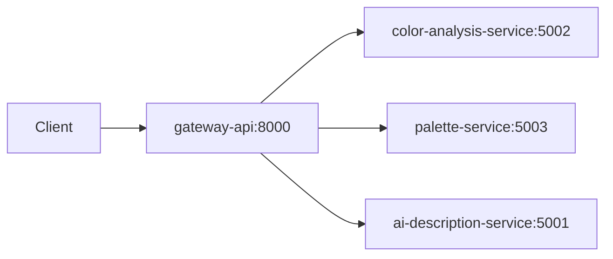

# ✨ Skin Tone & Color Analysis Microservices

Analyze personal colors to generate tailored clothing, makeup, and jewelry recommendations with AI support. Built as small, focused microservices that can run via Docker Compose or locally.

## 🏗️ Architecture



## 📋 Services

| Service                  | Port | Purpose                                                        |
| ------------------------ | ---- | -------------------------------------------------------------- |
| `color-analysis-service` | 5002 | Detects season & undertone from skin/hair/eye colors           |
| `palette-service`        | 5003 | Provides color palettes from MongoDB + jewelry recommendations |
| `ai-description-service` | 5001 | Generates AI descriptions based on season and palettes         |
| `gateway-api`            | 8000 | API gateway with Swagger documentation                         |

## 🚀 Quick Start (Docker)

### 1. Environment Setup

Create these files:

**`ai-description-service/.env`**

```env
PORT=5000
LANG=fa
MONGO_URI=mongodb://mongo:27017/skin_tone_app
OPENAI_API_KEY=your_openai_api_key
```

**`palette-service/.env`**

```env
PORT=5000
MONGO_URI=mongodb://mongo:27017/skin_tone_app
```

### 2. Start Services

```bash
docker-compose up -d --build
```

### 3. Seed Database

```bash
docker-compose exec palette-service npm run seed
```

### 4. Access Services

- **API Gateway**: http://localhost:8000
- **Swagger Docs**: http://localhost:8000/docs

## 🧑‍💻 Local Development

```bash
# Start all services
npm run dev

# Or start individually
npm run dev-gateway
npm run dev-ai
npm run dev-color
npm run dev-palette
```

Set environment variables for local development:

```bash
export COLOR_ANALYSIS_SERVICE_URL="http://localhost:5002/analyze"
export COLOR_PALETTE_SERVICE_URL="http://localhost:5003/recommend"
export AI_DESCRIPTION_SERVICE_URL="http://localhost:5001/describe"
```

## 📡 API Endpoints

- `POST /color-analysis/analyze` - Analyze colors and detect season/undertone
- `POST /color-palette/recommend` - Get personalized recommendations
- `POST /ai-description/describe` - Generate AI descriptions
- `GET /docs` - Swagger documentation

## 🔐 Required Environment Variables

- `OPENAI_API_KEY` - For AI description service
- `MONGO_URI` - MongoDB connection string for palette and AI services

## 🗂️ Project Structure

```
.
├── ai-description-service/
├── color-analysis-service/
├── gateway-api/
├── palette-service/
│   └── data/
├── docker-compose.yml
└── package.json
```

## 🆘 Support

Open an issue with detailed error messages and reproduction steps.
